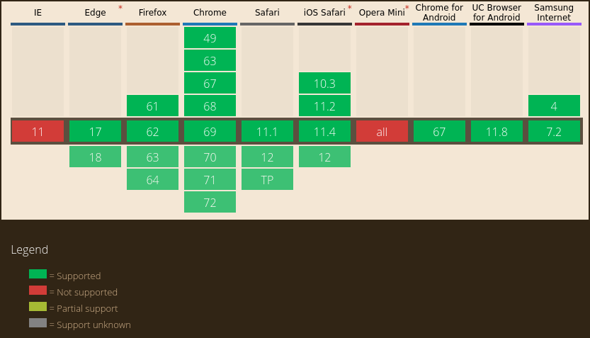

gorilla.js
==========


gorilla.js 🦍 - the only javascript utility library 🦄 you'll ever need.


## Small

Minified 6.41 KB 💪;
Minified and Gzipped only 2.6 KB bytes 🔥!

jQuery 3.0.0-alpha1 is 85 KB 😢;
Minified and Gzipped still a whopping 🍔 29 KB 🙈.


## Supported Browsers



### Internet Explorer 9

Don't be sad, we got you IE >= 9 users covered ❤.

(Even if this means supporting 7 years old software 🤷)

There's a `gorilla.compat.min.js` version, which even works in IE9 🚀👻!


## Methods

  - [gorilla.after](#gorillaafter)
  - [gorilla.ajax](#gorillaajax)
  - [gorilla.append](#gorillappend)
  - [gorilla.attr](#gorillaattr)
  - [gorilla.before](#gorillabefore)
  - [gorilla.compareJSON](#gorillacomparejson)
  - [gorilla.css](#gorillacss)
  - [gorilla.create](#gorillacreate)
  - [gorilla.data](#gorilladata)
  - [gorilla.DOMReady](#gorilladomready)
  - [gorilla.find](#gorillafind)
  - [gorilla.getUnixtime](#gorillagetunixtime)
  - [gorilla.getURLParams](#gorillageturlparams)
  - [gorilla.height](#gorillaheight)
  - [gorilla.html](#gorillahtml)
  - [gorilla.loadCSS](#gorillaloadcss)
  - [gorilla.loadJS](#gorillaloadjs)
  - [gorilla.on](#gorillaon)
  - [gorilla.prepend](#gorillaprepend)
  - [gorilla.remove](#gorillaremove)
  - [gorilla.serialize](#gorillaserialize)
  - [gorilla.stringFormat](#gorillastringformat)
  - [gorilla.waitForElementToBePresent](#gorillawaitforelementtobepresent)
  - [gorilla.width](#gorillawidth)


### gorilla.after

Wrapper for appending elements `after` some element.

```javascript
var newListElement = gorilla.create("li")
        .attr("style", "color:red;").html("New List Element");
// Appends a new list element after the 3rd li found in the DOM
gorilla.find("li").get(2).after(newListElement);
```


### gorilla.ajax

Simple ajax request wrapper which returns a promise.

```javascript
gorilla.ajax({
        url: "pokemon/pokedex.json",
        method: "POST",
        cache: true,
        requestContentType: "application/x-www-form-urlencoded",
        headers: {
                "X-Gorilla-Custom-Header": "This is really awesome!",
                "X-Gorilla-Custom-Header2": "Gorilla Fam for life!",
                "X-Gorilla-Style": "Best style in the universe!"
        },
        params: {
                format: "json",
                query: "all"
        }
})
.then((result) => {
        console.log(result);
})
.catch((err) => {
        console.log(err);
});
```

Consecutive ajax requests made easy and without callback hell:

```javascript
// first, load pokemon items
gorilla.ajax({ url: "pokemon/items.json" })
.then((pokemonItems) => {
        console.log(JSON.parse(pokemonItems));
        // after pokemon items have been loaded, load pokemon skills
        return gorilla.ajax({ url: "pokemon/skills.json" });
})
.catch((errPokemonItems) => {
        // loading pokemon items failed
        console.log(errPokemonItems);
})
.then((pokemonSkills) => {
        console.log(JSON.parse(pokemonSkills));
        // after pokemon skills have been loaded, load pokemon types
        return gorilla.ajax({ url: "pokemon/types.json" });
})
.catch((errPokemonSkills) => {
        // loading pokemon skills failed
        console.log(errPokemonSkills);
})
.then((pokemonTypes) => {
        // these are the pokemon types
        console.log(JSON.parse(pokemonTypes));
})
.catch((errPokemonTypes) => {
        // loading pokemon types failed
        console.log(errPokemonTypes);
});
```


### gorilla.append

Wrapper for `appendChild`.

```javascript
var newListElement = gorilla.create("li")
        .attr("style", "color:red;").html("New List Element");
gorilla.find("ul").get(0).append(newListElement);
```


### gorilla.attr

Wrapper for `setAttribute` and `getAttribute`.

```javascript
// retrieve `href` value of first link
gorilla.find("a").get(0).attr("href")

// set href value of first link
gorilla.find("a").get(0).attr("href", "#foo");
```

Set multiple values at once:

```javascript
gorilla.find("a").get(0).attr({
  "href": "test.html",
  "data-foo": "baz",
  "data-bar": "foo"
});
```


### gorilla.before

Wrapper for `insertBefore`.

```javascript
var newFirstListElement = gorilla.create("li").html("First List Element");
// Insert `newFirstListElement` before the first `li` found.
gorilla.find("li").get(0).before(newFirstListElement);
```


### gorilla.compareJSON

Compares to JSON structures and returns either `true` if they are _identical_
in terms of properties, or `false` if they don't have each others properties.

```javascript
var json1 = {
        foo: true,
        moo: false
};

var json2 = {
        foo: true,
        moo: false
};

var json3 = {
        foo: true,
        moo: true
};

var json4 = {
        foo: false,
        moo: false
};

// This should return true, because they are seen as "equal"
console.log(gorilla.compareJSON(json1, json2);

// This should return false, because they lack have the same
// properties, but not the same values for each property
console.log(gorilla.compareJSON(json3, json4);
```


### gorilla.css

Gets the `getComputedStyle` for an element.
Also can set CSS styles (`<div style="color:red;border:1px solid black;">`).

When used as a setter, it returns the element itself.
When used as a getter, it returns the values.

Get specific CSS style:

```javascript
gorilla.css(el, "color");
// or
gorilla.find("li").get(0).css("color");
```

Get all CSS styles:

```javascript
gorilla.css(el);
// or
gorilla.find("li").get(0).css();
```

Get specific CSS styles:

```javascript
gorilla.css(el, ["color", "border"]);
// or
gorilla.find("li").get(0).css(["color", "border"]);
```

Set CSS styles:

```javascript
gorilla.css(el, {
        color: "#f00",
        border: "1px solid #000"
});
// or
gorilla.find("li").get(0).css({
        color: "#f00",
        border: "1px solid #000"
});
```


### gorilla.create

Returns the element.

Wrapper for `document.createElement`.

```javascript
gorilla.create("input")
        .attr("type", "text")
        .attr("placeholder", "E-Mail");
```


### gorilla.data

Helper for setting and getting `data-` attributes.

#### Set single `data-` attribute

Returns the element.

Set one `data-` attribute (set `data-autosuggest` to string `true`):

```javascript
gorilla.create("input")
        .data("autosuggest", "true");
```

#### Set multiple `data-` attributes at once

Returns the element.

```javascript
gorilla.create("input")
        .data({
                autosuggest: true,
                timeout: false
                keynav: true
        });
```

#### Get single `data-` value

Returns a string or null.

Get `data-` value (get the value for `data-autosuggest`):

```javascript
gorilla.find("input").get(0).data("autosuggest");
```

#### Get multiple `data-` values at once

Returns JSON.

```javascript
gorilla.find("input").get(0).data([
  "autosuggest",
  "timeout"
]);
```

The output would look something like this:

```json
{
  "autosuggest": "true",
  "timeout": "25000"
}
```


### gorilla.DOMReady

Simple DOMReady wrapper.

```javascript
gorilla.DOMReady(function() {
        alert("dom is ready!");
});
```


### gorilla.find

Advanced `querySelectorAll` with attaching convenience methods to elements.
This method always returns an array of objects and you either need to use the
`get` method or the `find("selector")[3]` element by index method to get the
element.

```javascript
gorilla.find("ul").get(0)
        .find("li").get(2)
        .find("a").get(0)
        .on("click", function(evt) {
                evt.preventDefault();
                alert("click");
        });
```


### gorilla.getUnixtime

Returns the current UNIX-Timestamp.

```javascript
console.log(gorilla.getUnixtime());
```


### gorilla.getURLParams

Returns a URL params object.

```javascript
console.log(gorilla.getURLParams("index.php?param1=value1&param2=value2"));
```

Should return;

```json
{
        "param1": "value1",
        "param2": "value2"
}
```


### gorilla.height

Setter and getter for (DOM-)element height.

Usage:

```javascript
gorilla.height(el); // get the height of el
gorilla.find("ul").get(0).height(); // get the height of the first <ul> tag.
```

Set the height (numbers only - translated to px):

```javascript
gorilla.height(el, 200); // set height of el to 200px
// this translates to el.style.height = '200px';

// set the height of the first <ul> tag to 200px
gorilla.find("ul").get(0).height(200);
```


### gorilla.html

Wrapper for `innerHTML`.

```javascript
gorilla.find("a").get(0).html("This is a Hyperlink.");
```


### gorilla.loadCSS

Easy to use CSS file loader.
Creates a `<link rel="stylesheet" href="">` tag and returns a promise.

```javascript
gorilla.loadCSS("https://cdn.sstatic.net/Shared/stacks.css")
.then((el) => {
        // link tag
        console.log(el);
})
.catch((err) => {
        console.log(err);
});
```

or multiple files, one by one..

```javascript
gorilla.loadCSS("https://cdn.sstatic.net/Shared/stacks.css")
.then((el) => {
        console.log(el);
        return gorilla.loadCSS("https://cdn.sstatic.net/Sites/stackoverflow/primary-unified.css");
})
.catch((err) => console.log(err))
.then((el) => {
        console.log(el);
})
.catch((err) => console.log(err));
```


### gorilla.loadJS

Easy to use JavaScript file loader.
Create a `<script>` tag and returns a promise.

```javascript
gorilla.loadJS("https://cdnjs.cloudflare.com/ajax/libs/jquery/3.1.1/core.js")
.then((el) => {
        // script tag
        console.log(el);
})
.catch((err) => {
        console.log(err);
});
```

or multiple files, one by one..

```javascript
gorilla.loadJS("https://cdnjs.cloudflare.com/ajax/libs/jquery/3.1.1/core.js")
.then((el) => {
        console.log(el);
        return gorilla.loadJS("https://cdnjs.cloudflare.com/ajax/libs/jquery/3.1.1/jquery.js");
})
.catch((err) => console.log(err))
.then((el) => {
        console.log(el);
})
.catch((err) => console.log(err));
```

### gorilla.on

Simple wrapper for addEventListener.
Each element that was returned by `gorilla.find` has a method `on` attached to
it.

```javascript
gorilla.find("a").get(0).on(function(evt) {
        evt.preventDefault();
        alert("click");
});
```


### gorilla.prepend

Wrapper for `insertBefore`.

```javascript
var newFirstListElement = gorilla.create("li").html("First List Element");
// Insert `newFirstListElement` before the first `li` found.
gorilla.find("li").get(0).prepend(newFirstListElement);
```


### gorilla.remove

Removes a node and all its children.

```javascript
// Removes the first li tag found
gorilla.find("li").get(0).remove();
```


### gorilla.serialize

Encode a set of form elements (or JSON/JavaScript Object) as a string
for submission.

Serialize Form-data:

```javascript
gorilla.serialize(gorilla.find("form").get(0));
```

Serialze JSON:

```javascript
gorilla.serialize({
  id: 1,
  name: "Gorilla Moe",
  title: "Blogpost #1",
  content: "Awesome content goes here..",
  tags: {
    0: "javascript",
    1: "golang",
    2: "php",
    3: {
      0: "foo",
      1: "bar",
      2: "baz"
    }
  }
});

// Returns
// id=1&name=Gorilla%20Moe&title=Blogpost%20%231&content=Awesome%20content%20goes%20here..&tags[0]=javascript&tags[1]=golang&tags[2]=php&tags[3][0]=foo&tags[3][1]=bar&tags[3][2]=baz
```


### gorilla.stringFormat

Formats a string.

Usage:

```javascript
gorilla.stringFormat("I have %i apples and I really %s them.", 1337, "hate");
```

Or with more human friendly variables (because everything is a string 😜)

```javascript
gorilla.stringFormat("I have %count dogs and I really %mood them.", 3, "adore");
```


### gorilla.waitForElementToBePresent

Waits for DOM-Element to become present (/available).

Usage:

```javascript
// wait for element with id foobar to become ready
gorilla.waitForElementToBePresent("#foobar", (err, res) => {
        if (err) return console.log(err);
        console.log(res);
});
// append div#foobar after 2.5 seconds to the body tag
setTimeout(() => {
  document.body.appendChild(gorilla.create("div").attr("id","foobar"));
},2500);
```

Check every 200ms for element to become available, for a total of 10 seconds;
then fail.

```javascript
// wait for element with id foobar to become ready
gorilla.waitForElementToBePresent("#foobar", (err, res) => {
        if (err) return console.log(err);
        console.log(res);
}, {
        timeout: 10000,
        interval: 200
});
```


### gorilla.width

Setter and getter for (DOM-)element width.

Usage:

```javascript
gorilla.width(el); // get the width of el
gorilla.find("ul").get(0).width(); // get the width of the first <ul> tag.
```

Set the width (numbers only - translated to px):

```javascript
gorilla.width(el, 200); // set width of el to 200px
// this translates to el.style.width = '200px';

// set the width of the first <ul> tag to 200px
gorilla.find("ul").get(0).width(200);
```


## Credits

### Icon

[Icon](icon.png) (free for commercial use) made by [Martin Berube](https://twitter.com/imaginatoon).

